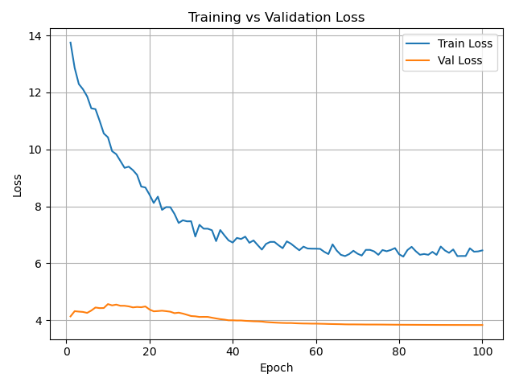
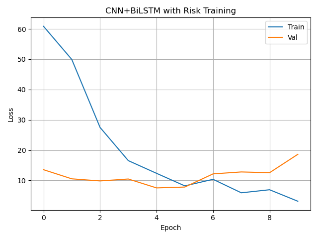

# 🧬 Alzheimer's & Parkinson's Protein Misfolding Detection

This project detects Alzheimer's, Parkinson's, and normal protein sequences based on misfolding risk using deep learning. It uses TAPE embeddings, BiLSTM + attention, and Transformer architectures, trained on `.pdb` sequences derived from Homo sapiens proteins.

---

## 📊 Model Comparison

| Model                | Accuracy    | Misfolding Risk MSE | Notes                          |
|---------------------|-------------|----------------------|-------------------------------|
| MLP (baseline)       | ~0.50       | 0.20+                | Shallow, not position-aware   |
| BiLSTM + Risk        | 0.65–0.83   | 0.09–0.12            | Sequence-aware                |
| BiLSTM + Attention   | 0.70+       | 0.08–0.11            | Better focus on key tokens    |
| Transformer + Risk   | 0.67–0.82   | 0.10–0.14            | Stronger on longer sequences  |
| CNN-BiLSTM + Risk    | ~0.65       | ~0.11                | Feature extraction + memory   |


### 📉 Training vs Validation Loss



### 📉 Transformer Training Loss




## 📂 Project Structure

A&P_Detection/
├── data/ # CSV and embedded .pkl files
│ ├── train.csv, val.csv, test.csv
│ └── embedded/
├── models/ # Model definitions
│ └── cnn_bilstm_with_risk.py, transformer_with_risk.py, etc.
├── saved_model/ # Trained .pt weights
├── scripts/ # Utility scripts (risk assign, window augmentation)
├── src/ # Training/evaluation/visualization
├── requirements.txt
└── README.md


---

## 🧠 How to Use

1. Extract Sequences from `.pdb` files
```bash
python src/extract_sequences.py

2. Generate TAPE Embeddings
python src/embed_sequences.py

3. Add Risk Scores (if missing)
python scripts/add_risk_to_pkl.py

4. Train Models
# Train BiLSTM
python src/train_bilstm_with_risk.py

# Train Transformer
python src/train_transformer_with_risk.py

#CNN-BiLSTM Hybrid
python src/train_cnn_bilstm_with_risk.py

5. Evaluate
python src/evaluate_bilstm_with_risk.py
python src/evaluate_transformer_with_risk.py


